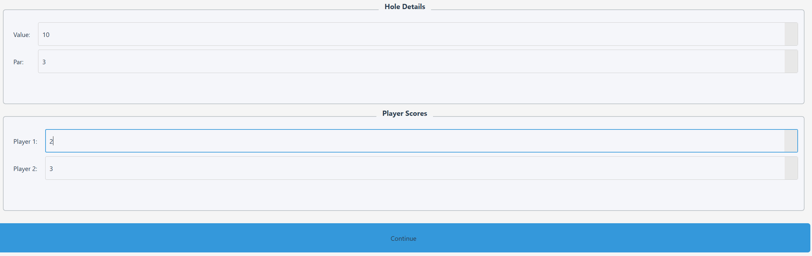

# Golf-Bet-Tracker
A Python program to assist golf bet calculations. A golf game is full of bets with its own extensive rules. This program is built to assist golf players in calculating how much every player owes each other in a golf game through score, voor, buchi, etc.

# Feature:
- Payment tracking based on buchi, voor, scoring multipliers (par, boogey, eagle, etc), and par
- Score tracking based on inputted score for each hole
- Full GUI program to ensure easy navigation and usage
- Double window pop-up: full game progress (score, voor, par, payment) and the gameplay, aka inputting scores and continuing the gameplay

# Tech Stack:
- PyQt5

# Screenshots:

# Installation & Usage
1. Clone the repository:
   git clone https://github.com/Marvell456/Golf-Bet-Tracker.git

2. Install dependencies:
   pip install -r requirements.txt

3. Run the program:
   python main.py

# Future Improvements
- Add buchi value
- Fix bugs
- Easier GUI navigation
- Downloadable on Android to make it more accessible and suitable for its purpose
